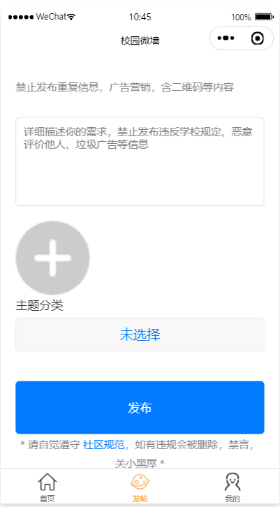

# school-miniapp
校园微墙小程序包括多个核心功能模块，每个模块都可以实现不同的功能，以提升用户体验和满足特定需求。以下是小程序设计思路及其核心功能模块：
1. 用户认证和管理
注册和登录：通过微信授权注册和登录。
用户资料管理：用户可以查看和编辑个人资料，包括头像、昵称等。
权限管理：区分普通用户和管理员，管理员具有发布、审核和删除内容的权限。
2. 内容发布
发布动态：用户可以发布文字、图片、视频等内容。
3. 互动功能
点赞：用户可以为动态点赞。
评论：用户可以对动态进行评论和回复。
4. 内容分类和搜索
分类浏览：根据不同类别浏览动态内容，如拼车拼单、表白墙、日常投稿等。
关键词搜索：通过关键词搜索动态内容。
5. 后台管理
内容审核：管理员可以审核用户发布的内容，确保内容合规。
系统设置：管理员可以进行系统参数配置和维护。
该小程序设计思路
用户体验优先：
界面设计简洁、美观，操作流程顺畅。
高效的后台管理：
提供完善的后台管理功能，支持内容审核、数据分析等。
确保系统稳定、安全，数据备份和恢复机制完善。
技术选型和架构设计：
前端使用微信小程序框架，利用其丰富的API和组件库。
后端采用springboot+mybatis
数据库选择MySQL
安全和性能优化：
数据传输加密，保护用户隐私。
优化数据库查询和接口响应，提升性能。
部分小程序实现图：

